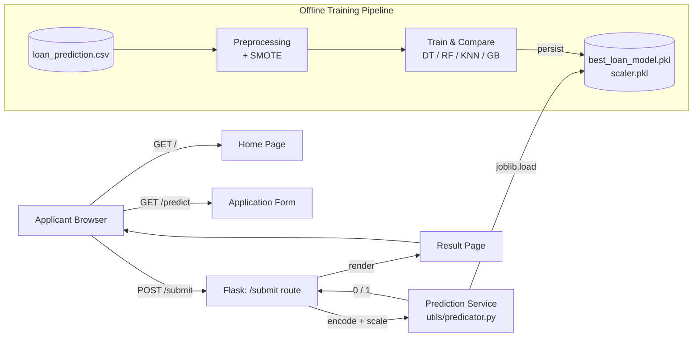

# 💰 Smart Lender — AI-Powered Loan Eligibility Prediction System

> A machine learning-powered web application that predicts loan eligibility in real time, helping banks and NBFCs move from slow, manual review to fast, consistent, data-driven decisions.

**🎓 SmartBridge Virtual Internship Project**

[](https://www.python.org/)
[](https://flask.palletsprojects.com/)
[](https://scikit-learn.org/)

---

## 📌 Table of Contents

- [About the Project](#-about-the-project)
- [Problem Statement](#-problem-statement)
- [Team](#-team)
- [Features](#-features)
- [Tech Stack](#%EF%B8%8F-tech-stack)
- [System Architecture](#%EF%B8%8F-system-architecture)
- [Dataset](#-dataset)
- [Machine Learning Pipeline](#-machine-learning-pipeline)
- [Model Comparison](#-model-comparison)
- [Project Structure](#-project-structure)
- [Getting Started](#-getting-started)
- [Usage](#-usage)
- [API / Routes](#-api--routes)
- [Testing](#-testing)
- [Screenshots](#%EF%B8%8F-screenshots)
- [Known Limitations](#%EF%B8%8F-known-limitations)
- [Future Scope](#-future-scope)
- [Documentation](#-documentation)
- [Contributing](#-contributing)
- [Acknowledgments](#-acknowledgments)

---

## 📖 About the Project

**Smart Lender** predicts whether a loan applicant is likely to be approved or rejected, based on personal, financial, and credit-history details submitted through a simple web form. Instead of a multi-day manual review by a credit officer, applicants get an instant, consistent, model-backed decision.

The deployed model was selected by training and comparing **four classification algorithms** — Decision Tree, Random Forest, K-Nearest Neighbors, and Gradient Boosting — on a historical loan dataset, using 5-fold cross-validation as the selection criterion rather than defaulting to a single algorithm.

## 🎯 Problem Statement

> Manual, judgment-based loan eligibility assessment is slow, inconsistent across reviewers, and difficult to scale — leading to delayed decisions for applicants and increased risk exposure for lenders.

- **Applicants** wait days for a decision with little explanation.
- **Credit officers** manually re-check the same categories of information for every file, which does not scale during high-volume periods.

Smart Lender addresses both by returning a same-request, evidence-based prediction.

## 👥 Team

This project was built as part of the **SmartBridge Virtual Internship Program** by a team of 5.

| # | Name | Role | GitHub |
|---|------|------|--------|
| 1 | Mahesh Reddy I| Team Lead / ML Engineer | [@mahesh](https://github.com/Mahesh-Reddy-I) |
| 2 | Asif S| Data Preprocessing & Feature Engineering | [@asif](https://github.com/Asif7842-ops) |
| 3 | Bharath K | Model Building & Evaluation | [@bharath](https://github.com/bharathyt5623-ai) |
| 4 | Chethan S | Backend Developer (Flask, API) | [@chethan](https://github.com/chethanstack) |
| 5 | Lohith Sai K | Frontend Developer (UI/UX) | [@lohithsai](https://github.com/lohithsai1115-beep) |

> ✏️ Replace the placeholders above with actual team member names and GitHub handles before pushing.

## ✨ Features

- 📝 Simple, guided web form for loan applications (11 input fields)
- ⚡ Real-time eligibility prediction (Approved / Rejected) in a single request
- 🤖 Model selected via cross-validated comparison of 4 algorithms, not a single default
- ⚖️ Class imbalance corrected with SMOTE during training
- 🧩 Clean separation of concerns: routing (`app.py`), prediction service (`utils/predicator.py`), and persisted ML artifacts (`models/`)
- 📓 Fully reproducible ML pipeline documented in Jupyter notebooks

## 🛠️ Tech Stack

| Layer | Technology |
|---|---|
| **Frontend** | HTML5, CSS3, JavaScript |
| **Backend** | Python, Flask |
| **Machine Learning** | scikit-learn (Random Forest, Decision Tree, KNN, Gradient Boosting) |
| **Data Processing** | pandas, NumPy |
| **Class Balancing** | imbalanced-learn (SMOTE) |
| **Model Persistence** | joblib |
| **Experimentation** | Jupyter Notebook |
| **Deployment (proposed)** | IBM Cloud / equivalent PaaS + Gunicorn |

## 🏗️ System Architecture



## 📊 Dataset

- **Source file:** `dataset/loan_prediction.csv`
- **Records:** 614
- **Columns:** 13 (12 features + `Loan_Status` target)
- **Target variable:** `Loan_Status` (Y/N → encoded 1/0)

| Feature | Type |
|---|---|
| Gender, Married, Education, Self_Employed, Property_Area | Categorical |
| Dependents | Categorical (0/1/2/3+) |
| ApplicantIncome, CoapplicantIncome, LoanAmount, Loan_Amount_Term | Numeric |
| Credit_History | Binary (0/1) |

7 of the 13 columns had missing values at collection time (up to 8.1% in `Credit_History`), resolved via mode/median imputation — see `notebooks/data_preprocessing.ipynb`.

## 🔬 Machine Learning Pipeline

1. **Data Collection** — load `loan_prediction.csv`
2. **Exploratory Data Analysis** — profile nulls, distributions, class balance
3. **Data Preprocessing** — impute missing values, encode categorical fields
4. **Feature Engineering** — scale features with `StandardScaler`
5. **Class Balancing** — apply `SMOTE` to the training split only
6. **Model Building** — train Decision Tree, Random Forest, KNN, Gradient Boosting
7. **Model Evaluation** — 5-fold cross-validation accuracy comparison
8. **Model Selection** — best performer persisted with `joblib`
9. **Deployment** — model + scaler loaded once at Flask startup

## 🏆 Model Comparison

| Model | Training Accuracy | Testing Accuracy | CV Accuracy |
|---|---|---|---|
| **Random Forest** ✅ *(selected)* | 100.00% | 77.83% | **81.04%** |
| Gradient Boosting | 92.73% | 76.85% | 78.20% |
| K-Nearest Neighbors | 84.22% | 74.38% | 73.94% |
| Decision Tree | 100.00% | 76.35% | 72.69% |

**Random Forest** was selected using **5-fold cross-validation accuracy** as the primary metric (not raw training accuracy, which is misleadingly high for overfit models).

> ℹ️ Note: some earlier project descriptions referenced XGBoost. The current, verified implementation compares Decision Tree, Random Forest, KNN, and `GradientBoostingClassifier` (scikit-learn) — Random Forest is what is actually trained, evaluated, and deployed. Swap in `XGBClassifier` in `notebooks/model_building.ipynb` if XGBoost is required going forward.

## 📁 Project Structure

```
Smart-Lender/
├── app.py                          # Flask entry point (routes: /, /predict, /submit)
├── requirements.txt                # Pinned Python dependencies
├── utils/
│   └── predicator.py               # Loads model + scaler, exposes predict_loan()
├── templates/
│   ├── home.html                   # Landing page
│   ├── predict.html                # Loan application form
│   └── submit.html                 # Result page
├── static/
│   ├── css/style.css
│   └── js/script.js
├── dataset/
│   └── loan_prediction.csv         # Historical training data (614 records)
├── artifacts/
│   └── cleaned_dataset.csv         # Preprocessed / SMOTE-balanced data
├── models/
│   ├── best_loan_model.pkl         # Persisted Random Forest classifier
│   └── scaler.pkl                  # Persisted StandardScaler
├── notebooks/
│   ├── data_preprocessing.ipynb    # EDA, cleaning, encoding, SMOTE
│   └── model_building.ipynb        # Model training, evaluation, selection
└── README.md
```

## 🚀 Getting Started

### Prerequisites

- Python 3.10+
- pip

### Installation

```bash
# 1. Clone the repository
git clone https://github.com/Mahesh-Reddy-I/Smart-Lender.git
cd Smart-Lender

# 2. Create and activate a virtual environment
python -m venv venv
source venv/bin/activate          # Windows: venv\Scripts\activate

# 3. Install dependencies
pip install -r requirements.txt

# 4. Run the application
python app.py
```

The app will be available at **http://127.0.0.1:5000/**.

> To retrain the model from scratch, run the notebooks in order: `notebooks/data_preprocessing.ipynb` → `notebooks/model_building.ipynb`. This regenerates `models/best_loan_model.pkl` and `models/scaler.pkl`.

## 💻 Usage

1. Open the home page and click **Apply Now**.
2. Fill in the loan application form (personal details, income, loan amount, credit history, property area).
3. Submit the form to instantly receive an **Approved** or **Rejected** result.

## 🔌 API / Routes

| Route | Method | Description |
|---|---|---|
| `/` | GET | Renders the home page |
| `/predict` | GET | Renders the loan application form |
| `/submit` | POST | Reads form data, encodes & scales it, returns the prediction result page |

## 🧪 Testing

The application was tested end-to-end against a **live, running instance** (not just unit-tested in isolation):

| Test Type | Result |
|---|---|
| Functional Testing | 10 / 12 test cases passed (83.3%) |
| Performance (single request, warm) | ~6 ms average response time |
| Performance (20 concurrent requests) | All 20 succeeded in 0.94s total |
| UAT — Business Scenario 1 (low-risk approval) | ✅ Pass |
| UAT — Business Scenario 2 (high-risk rejection) | ✅ Pass |

**Known open defect:** `/submit` currently has no server-side input validation — a missing or malformed field returns an unhandled HTTP 500 instead of a friendly error. Tracked as the top-priority fix (see [Known Limitations](#%EF%B8%8F-known-limitations)).

## 🖼️ Screenshots


| Page | Preview |
|---|---|
| Home | [Home Page](docs/screenshots/home.png) |
| Application Form |[Application Form](docs/screenshots/application-form.png) |
| Result — Approved | [Approved Result](docs/screenshots/appoved.png) |
| Result — Rejected | [Rejected Result](docs/screenshots/rejected.png) |

## ⚠️ Known Limitations

- ❌ No server-side input validation on `/submit` (missing/malformed fields cause an HTTP 500)
- ❌ No authentication, HTTPS, or CSRF protection
- ❌ Runs on Flask's single-threaded development server (not production-grade)
- ❌ No database — predictions are not persisted or logged
- ❌ Trained on a relatively small dataset (614 records)

## 🔮 Future Scope

- [ ] Add server-side input validation with clear error messages
- [ ] Deploy behind a production WSGI server (Gunicorn) on a cloud platform
- [ ] Add explainable-AI reason codes for predictions
- [ ] Add authentication and role-based access (applicant vs. credit officer)
- [ ] Persist predictions to a database for audit/compliance (see proposed ERD in project docs)
- [ ] Expand and periodically retrain on a larger dataset
- [ ] Explore OCR-based document auto-fill and a mobile app

## 📚 Documentation

Full phase-by-phase project documentation (Ideation, Requirement Analysis, Design, Planning, Development, Testing, Final Report, Demonstration) is maintained separately from this README — see the `/project-documentation` folder or the project's shared documentation drive.

## 🤝 Contributing

This is an academic/internship project. Team members should:

1. Create a feature branch: `git checkout -b feature/your-feature`
2. Commit changes: `git commit -m "Add: your feature"`
3. Push and open a Pull Request for review before merging to `main`

## 🙏 Acknowledgments

- **SmartBridge / SmartInternz** — Virtual Internship Program
- scikit-learn, Flask, and the open-source Python data science community
- Dataset: historical loan approval data (`dataset/loan_prediction.csv`)

---

<div align="center">

**Built with ❤️ by Team Smart Lender — SmartBridge Virtual Internship**

</div>
